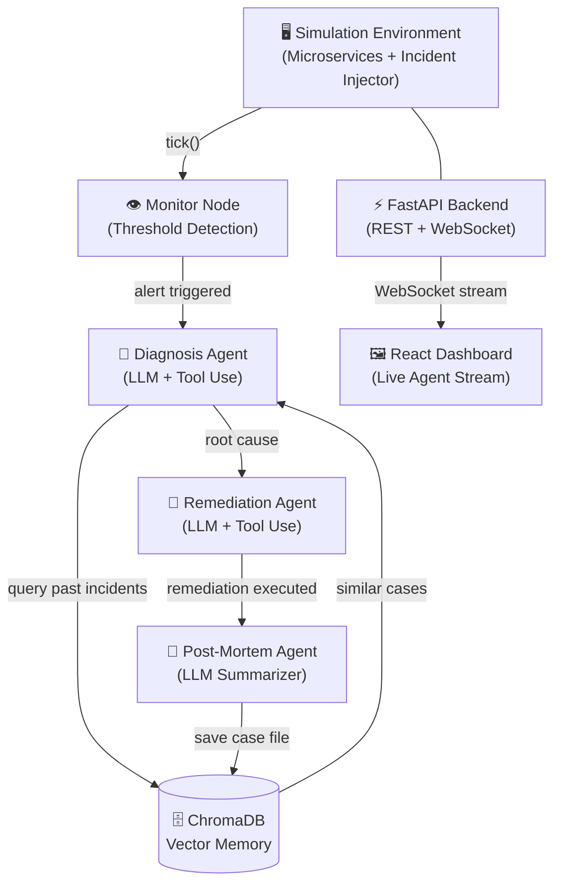

# 🛡️ Sentinel AI — Autonomous DevOps Incident Response Agent


> **An autonomous, memory-augmented multi-agent system that detects, diagnoses, and remediates DevOps incidents in real-time — with zero human intervention.**

---

## ▶️ Demo

> ⚠️ *Add your dashboard GIF/screenshot here!*
> Record a 2-3 min Loom/YouTube walkthrough showing the memory leak trigger → agent response → ChromaDB post-mortem. Paste the link below.*

`[🎬 Watch the Demo](YOUR_LOOM_OR_YOUTUBE_LINK_HERE)`

---

## 🔥 The Problem

In modern microservice architectures, memory leaks, CPU spikes, and cascading failures require **manual SRE intervention**. The on-call engineer has to:

1. Get paged at 2am
2. SSH into a service, pull logs, check metrics
3. Diagnose the root cause under pressure
4. Execute a fix (or escalate)
5. Write a post-mortem

This process is slow, error-prone, and expensive. The industry average **Mean Time to Recovery (MTTR)** for a P1 incident is **60-90 minutes**.

## ✅ The Solution

Sentinel AI **automates the full Tier-1 SRE workflow**. When a metric anomaly is detected, a coordinated team of AI agents wakes up, investigates the issue using live metrics and logs, retrieves context from a **long-term memory layer**, executes a safe remediation, and logs a structured post-mortem — all autonomously, in seconds.

---

## 🏗️ Architecture



### The 4-Agent Pipeline

| Agent | Role | LLM Used |
|---|---|---|
| **Monitor Node** | Pure Python rule-engine. Checks CPU, Memory, Latency, Error Rate against baselines. Zero LLM cost. | None |
| **Diagnosis Agent** | Queries ChromaDB for historical patterns, then uses tools (`get_metrics`, `get_logs`) to verify root cause. | GPT-4o-mini |
| **Remediation Agent** | Reads diagnosis, classifies fix as LOW/MEDIUM/HIGH risk, and executes safe actions autonomously. | GPT-4o-mini |
| **Post-Mortem Agent** | Extracts Symptoms, Root Cause, and Resolution from the conversation and persists it to ChromaDB. | GPT-4o-mini |

### Memory-First Diagnosis
A key design pattern: the Diagnosis Agent **always checks ChromaDB first** before deep analysis. After several incident cycles, the system recognizes recurring patterns and resolves them significantly faster — a compounding intelligence effect.

---

## 🛠️ Tech Stack

| Layer | Technology |
|---|---|
| Agent Orchestration | LangGraph, LangChain |
| LLM | OpenAI GPT-4o-mini |
| Vector Memory | ChromaDB (persistent) |
| API Layer | FastAPI, WebSockets |
| Frontend | React 18, Vite, Vanilla CSS |
| Simulation | Custom Python tick-based microservice simulator |

---

## 🚀 How to Run

### Prerequisites
- Python 3.10+
- Node.js 18+
- An OpenAI API Key

### 1. Backend Setup

```bash
# Clone the repository
git clone https://github.com/VnMxMadMax/devops-agent.git
cd devops-agent

# Create and activate virtual environment
python -m venv venv
venv\Scripts\activate      # Windows
# source venv/bin/activate  # Mac/Linux

# Install dependencies
pip install -r requirements.txt

# Configure your API key
cp .env.example .env
# Edit .env and add: OPENAI_API_KEY=your_key_here

# Start the API server
uvicorn api.main:app --port 8000 --reload
```

### 2. Frontend Setup

```bash
# In a second terminal
cd dashboard
npm install
npm run dev
```

Open **`http://localhost:5173`** in your browser.

---

## 🎮 Usage

1. Open the dashboard at `http://localhost:5173`
2. The service health matrix shows all simulated microservices as **healthy**
3. Click **"Trigger Memory Leak"** — the `auth-service` memory begins to climb
4. When memory crosses **65%**, the Monitor Node fires automatically
5. Watch the **Agent Event Stream** as the pipeline runs:
   - 🧠 Diagnosis Agent queries ChromaDB for past incidents
   - 🔧 Remediation Agent restarts the service
   - 📝 Post-Mortem Agent logs the case to vector memory
6. On the next incident, the Diagnosis Agent will recognize the pattern from memory!

> **💡 Cost Note:** The LangGraph pipeline is **event-driven**. LLM calls only happen when an active incident is detected. Healthy ticks are pure Python — zero API cost.

---

## 🔮 Future Scope

- [ ] **Real Alert Ingestion** — Wire to Prometheus/Datadog webhooks instead of the simulation
- [ ] **Slack / PagerDuty Integration** — Post incident summaries and resolution notices to on-call channels
- [ ] **Kubernetes Support** — Add remediation tools for pod restarts and deployment rollbacks
- [ ] **Local LLM Mode** — Replace OpenAI with Llama 3 / Mistral via Ollama for privacy and zero inference cost
- [ ] **Multi-Incident Concurrency** — Handle parallel incidents across different services simultaneously
- [ ] **LangSmith Observability** — Full trace logging per incident for auditability and debugging

---

## 📁 Project Structure

```
devops-agent/
├── agents/
│   ├── orchestrator.py    # LangGraph graph definition & node wiring
│   ├── monitor.py         # Threshold-based alert detection
│   ├── diagnosis.py       # Memory-first root cause analysis
│   ├── remediation.py     # Risk-classified auto-remediation
│   ├── postmortem.py      # Incident summarization & ChromaDB persistence
│   ├── tools.py           # get_metrics, get_logs, restart_service, query_memory
│   └── state.py           # Shared AgentState schema (LangGraph)
├── api/
│   ├── main.py            # FastAPI app, WebSocket endpoint, REST routes
│   └── models.py          # Pydantic request/response schemas
├── memory/
│   └── incident_memory.py # ChromaDB client wrapper
├── simulator/
│   ├── environment.py     # Simulation tick engine
│   ├── incident.py        # Incident definitions & metric impact curves
│   └── service.py         # Microservice model
└── dashboard/             # React + Vite frontend
    └── src/
        ├── App.jsx
        └── index.css
```

---

*Built as a portfolio project to demonstrate real-world multi-agent LLM system design, async Python architecture, and full-stack integration.*
