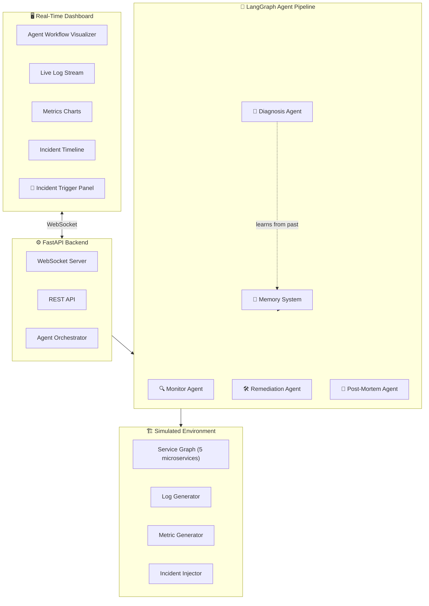
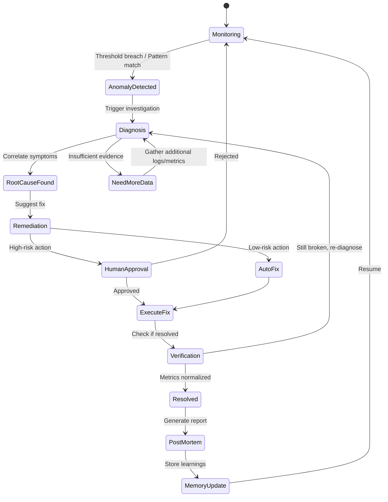

# 🛡️ DevOps Incident Response Agent — Implementation Plan

An autonomous multi-agent system that monitors application logs & metrics, detects anomalies, diagnoses root causes, and suggests/executes remediation — all with a stunning real-time dashboard.

## Architecture Overview



## Simulated Environment Design

> [!IMPORTANT]
> This is the **secret sauce** that makes the project demo-able. Instead of connecting to real infra, we simulate a realistic microservices architecture.

### Simulated Microservices

| Service | Role | Typical Incidents |
|---|---|---|
| `api-gateway` | Entry point, routes requests | High latency, connection timeouts |
| `auth-service` | Authentication & JWT | Token validation failures, memory leak |
| `order-service` | Business logic | CPU spike, unhandled exceptions |
| `payment-service` | Payment processing | Third-party API timeout, retry storms |
| `postgres-db` | Database | Connection pool exhaustion, slow queries |

### Incident Scenarios (Pre-built)

| # | Incident | Root Cause | Cascading Effect |
|---|---|---|---|
| 1 | 🔴 **Database Connection Pool Exhaustion** | Slow query in `order-service` holding connections | `api-gateway` returns 503s |
| 2 | 🟠 **Memory Leak** | `auth-service` leaking JWT decode objects | OOM kill → service restart loop |
| 3 | 🔴 **Cascading Failure** | `payment-service` timeout → retry storm → CPU spike across all services | Full system degradation |
| 4 | 🟡 **Disk Space Alert** | Log rotation failure in `order-service` | Slow writes → increased latency |
| 5 | 🔴 **DNS Resolution Failure** | Simulated DNS outage for `payment-service` external API | Connection errors propagate |
| 6 | 🟠 **Certificate Expiry** | TLS cert expired on `auth-service` | Intermittent auth failures |

Each scenario generates **realistic logs** (with timestamps, service names, log levels, stack traces) and **metrics** (CPU%, memory%, request latency, error rates) that evolve over time.

---

## Agent Pipeline Design



### Agent Descriptions

#### 1. Monitor Agent
- Continuously watches metrics and log streams
- Uses **rule-based + LLM-based** anomaly detection
- Rules: CPU > 85%, memory > 90%, error rate > 5%, latency p99 > 2s
- LLM: Pattern-matches unusual log sequences
- **Output**: Alert with severity, affected service, initial symptoms

#### 2. Diagnosis Agent
- Receives alert from Monitor Agent
- **Tools available**:
  - `get_service_logs(service, time_range)` — fetch recent logs
  - `get_service_metrics(service, metric_type)` — fetch CPU/memory/latency
  - `get_service_dependencies(service)` — get upstream/downstream services
  - `query_incident_memory(symptoms)` — search past incidents for similar patterns
  - `get_recent_deployments()` — check for recent changes
- Uses **ReAct pattern** — reasons step-by-step, calls tools, analyzes results
- **Output**: Root cause analysis with confidence score and evidence chain

#### 3. Remediation Agent
- Receives diagnosis with root cause
- **Tools available**:
  - `restart_service(service)` — restart a specific service
  - `scale_service(service, replicas)` — scale up/down
  - `rollback_deployment(service)` — rollback to last known good version
  - `flush_connection_pool(service)` — reset DB connections
  - `update_rate_limit(service, limit)` — adjust rate limiting
  - `clear_cache(service)` — invalidate cache
- **Safety Classification**:
  - 🟢 Low-risk (auto-execute): restart, clear cache, flush connections
  - 🟡 Medium-risk (confirm): scale, rate limit changes
  - 🔴 High-risk (human approval required): rollback, config changes
- **Output**: Remediation plan with actions, risk levels, expected outcome

#### 4. Post-Mortem Agent
- Triggered after incident is resolved
- Generates a structured incident report:
  - Timeline of events
  - Root cause analysis
  - Actions taken
  - Impact assessment (duration, affected services, error count)
  - Prevention recommendations
- Stores learnings in the **Memory System** for future reference

#### 5. Memory System (Vector DB)
- Stores past incident embeddings for similarity search
- Enables the Diagnosis Agent to learn from history
- Schema: `{incident_type, symptoms, root_cause, resolution, timestamp}`
- Uses ChromaDB (local, no setup needed)

---

## Tech Stack

| Component | Technology | Why |
|---|---|---|
| Agent Framework | **LangGraph** | Best for complex agent workflows with state management |
| LLM | **Google Gemini 2.0 Flash** | Free tier, fast, good reasoning |
| Backend | **FastAPI** | You already know it, great WebSocket support |
| Real-time | **WebSockets** | Live dashboard updates |
| Vector DB | **ChromaDB** | Local, zero-config, perfect for memory system |
| Database | **SQLite** | Incident history, lightweight |
| Frontend | **HTML/CSS/JS** | Single-page dashboard, no framework needed |
| Charts | **Chart.js** | Beautiful real-time metrics charts |
| Deployment | **Docker + Render** | You've done this before |

> [!NOTE]
> **LLM Choice**: Using Google Gemini 2.0 Flash because it has a generous free tier (1500 req/day). If you have OpenAI credits, we can switch to GPT-4o-mini. The code will be LLM-agnostic.

---

## Project Structure

```
d:\Personal\devops-agent\
├── README.md
├── requirements.txt
├── Dockerfile
├── .env.example
├── main.py                          # FastAPI app entry point
│
├── simulator/                       # Simulated environment
│   ├── __init__.py
│   ├── services.py                  # Microservice definitions
│   ├── log_generator.py             # Realistic log generation
│   ├── metric_generator.py          # CPU, memory, latency metrics
│   ├── incidents.py                 # Pre-built incident scenarios
│   └── environment.py               # Orchestrates the simulation
│
├── agents/                          # LangGraph agents
│   ├── __init__.py
│   ├── orchestrator.py              # Main agent pipeline (LangGraph)
│   ├── monitor.py                   # Monitor agent
│   ├── diagnosis.py                 # Diagnosis agent with tools
│   ├── remediation.py               # Remediation agent with safety
│   ├── postmortem.py                # Post-mortem report generator
│   └── tools.py                     # Tool definitions for agents
│
├── memory/                          # Memory system
│   ├── __init__.py
│   └── incident_memory.py           # ChromaDB incident memory
│
├── models/                          # Data models
│   ├── __init__.py
│   └── schemas.py                   # Pydantic models
│
├── api/                             # API routes
│   ├── __init__.py
│   ├── routes.py                    # REST endpoints
│   └── websocket.py                 # WebSocket handlers
│
├── database/                        # SQLite database
│   ├── __init__.py
│   └── db.py                        # Database operations
│
├── frontend/                        # Dashboard
│   ├── index.html
│   ├── css/
│   │   └── style.css
│   └── js/
│       ├── app.js                   # Main application logic
│       ├── websocket.js             # WebSocket connection
│       ├── charts.js                # Metrics charts
│       ├── agent-visualizer.js      # Agent workflow visualization
│       └── log-viewer.js            # Log stream viewer
│
└── tests/                           # Tests
    ├── test_simulator.py
    └── test_agents.py
```

---

## Frontend Dashboard Design

The dashboard will have a **dark theme** with a **command center** aesthetic — think mission control meets modern DevOps.

### Layout (Single Page, 4 Panels)

```
┌──────────────────────────────────────────────────────────────┐
│  🛡️ SENTINEL AI — DevOps Incident Response     [Status: ●]  │
├────────────────────────┬─────────────────────────────────────┤
│                        │                                     │
│   📊 METRICS PANEL     │    🤖 AGENT WORKFLOW PANEL          │
│                        │                                     │
│   CPU [████░░] 67%     │    ┌─────────┐                     │
│   MEM [██████] 89% ⚠️  │    │ Monitor │ ← Active            │
│   LAT [███░░░] 145ms   │    └────┬────┘                     │
│   ERR [█░░░░░] 2.1%    │         ↓                          │
│                        │    ┌──────────┐                     │
│   (per-service charts) │    │ Diagnose │ ← Thinking...      │
│                        │    └────┬─────┘                     │
│                        │         ↓                          │
│                        │    ┌────────────┐                   │
│                        │    │ Remediate  │                   │
│                        │    └────────────┘                   │
│                        │                                     │
├────────────────────────┼─────────────────────────────────────┤
│                        │                                     │
│   📋 LOG STREAM        │    🕐 INCIDENT TIMELINE             │
│                        │                                     │
│   [auth-service] ERROR │    ● 14:23 — Alert triggered       │
│   JWT decode failed... │    ● 14:24 — Diagnosis started     │
│   [api-gateway] WARN   │    ● 14:25 — Root cause: mem leak  │
│   Upstream timeout...  │    ● 14:26 — Restart executed      │
│   [order-svc] INFO     │    ● 14:27 — ✅ Resolved           │
│   Processing order...  │                                     │
│                        │    [🔴 Trigger Incident ▼]          │
│                        │                                     │
└────────────────────────┴─────────────────────────────────────┘
```

### Design Aesthetic
- **Dark mode** with `#0a0a1a` background
- **Neon accents**: Green (`#00ff88`) for healthy, Red (`#ff3366`) for critical
- **Glassmorphism** panels with subtle backdrop blur
- **Smooth animations**: Metrics pulse, logs scroll, agent nodes glow when active
- **Monospace font** for logs (JetBrains Mono), Sans-serif for UI (Inter)

---

## User Review Required

> [!IMPORTANT]
> ### LLM Choice
> I'm planning to use **Google Gemini 2.0 Flash** (free tier). Do you have:
> - A Google AI API key? (free at aistudio.google.com)
> - Or do you prefer OpenAI / Groq / another provider?

> [!IMPORTANT]
> ### Project Name
> I'm calling it **"Sentinel AI"** — a DevOps incident response agent. Happy with this name, or do you have a preference?

---

## Build Phases

### Phase 1: Foundation (Day 1-2)
- Project setup, dependencies, file structure
- Simulated environment with log/metric generation
- Incident scenarios (at least 3)

### Phase 2: Agent Core (Day 3-5)
- LangGraph orchestrator setup
- Monitor Agent with threshold-based detection
- Diagnosis Agent with ReAct tool use
- Remediation Agent with safety classification

### Phase 3: Memory & Intelligence (Day 6)
- ChromaDB incident memory
- Post-mortem agent
- Learning from past incidents

### Phase 4: Dashboard (Day 7-9)
- Real-time WebSocket dashboard
- Metrics charts (Chart.js)
- Agent workflow visualizer
- Log stream viewer
- Incident trigger panel

### Phase 5: Polish & Deploy (Day 10)
- Docker containerization
- Deploy to Render
- README with GIF demos
- Clean up code for GitHub

---

## Verification Plan

### Automated Tests
- `pytest` for simulator (verify realistic log/metric generation)
- `pytest` for agents (mock LLM responses, verify tool usage)
- End-to-end test: trigger incident → verify detection → verify diagnosis → verify remediation

### Manual Verification
- Trigger each incident scenario and verify agent handles it correctly
- Check dashboard renders in real-time without lag
- Verify memory system recalls past incidents
- Test human-in-the-loop approval flow

### Demo Verification
- Record a full demo video (trigger incident → agent responds → resolution)
- Verify the entire flow takes < 60 seconds (good for interviews)

---